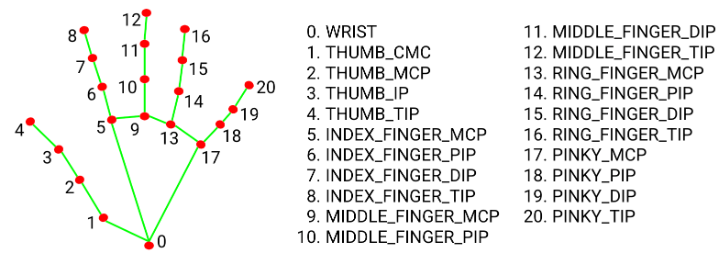
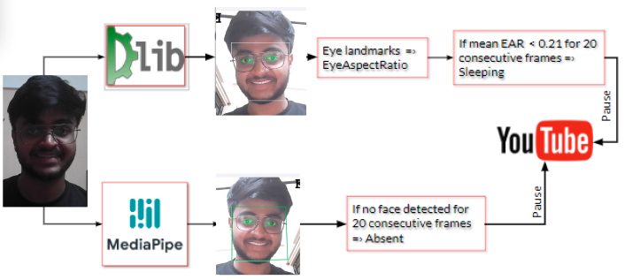
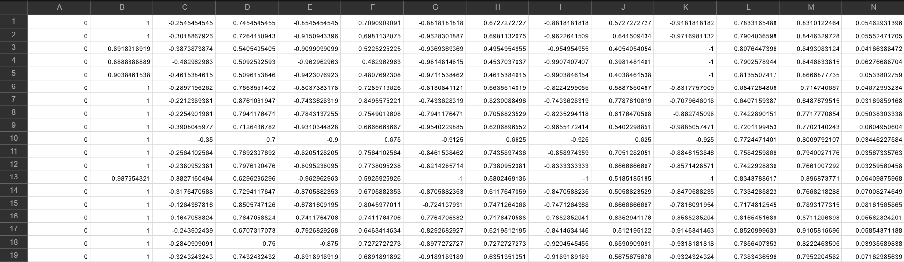
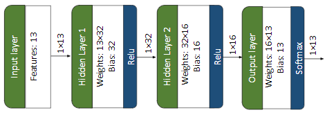
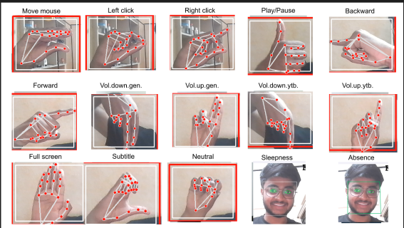

# Vision-Based Gestural Interface for Video Control :An Implementation of Real-Time Hand Gesture Recognition with Sleep and Absence Detection

## Index
1. [Introduction](#introduction)
2. [Methodology](#methodology)  
    * [Hand Gesture Recognition](#hand-gesture-recognition)  
    * [Sleep Detection](#sleep-detection)    
    * [User Absence Detection](#user-absence-detection)  
3. [Project Structure](#project-structure)
4. [Implementation Guide](#implementation-guide)
    * [Setting Up Dependencies](#setting-up-dependencies)
    * [Data Collection](#data-collection)
    * [Model Training](#model-training)
    * [Launching the Application](#launching-the-application)
5. [Current Challenges](#current-challenges)
6. [References](#references)

## Introduction
Gesture-based interfaces enable users to interact with systems using body movements, particularly hand gestures. These systems are increasingly prevalent across various domains including home automation, healthcare, automotive, and virtual reality environments. Well-designed gesture interfaces offer intuitive and natural interaction patterns that users can quickly adapt to.

This project aims to develop a system that recognizes hand gestures via an Artificial Neural Network to control a YouTube video player. Additionally, the system incorporates automatic pause functionality when it detects the user is sleeping or has left the viewing area. You can see a demonstration [here](https://www.youtube.com/watch?v=eF8Kz6bEl-A).

YouTube was selected as the target application due to its widespread popularity, web-based accessibility, diverse content library, and no installation requirements. However, the same gesture recognition methodology could be adapted to control local media players or other applications with keyboard shortcut support or API access.

## Methodology

### Hand Gesture Recognition
The gesture recognition system implemented in this project draws inspiration from Nikita Kiselov's approach. A key advantage of this methodology is that it doesn't require large image datasets for training, instead utilizing landmark coordinates as model inputs.

The recognition process follows these steps:

* Extract 2D coordinates using [MediaPipe's hand detector](https://github.com/google-ai-edge/mediapipe), which provides 21 landmarks as shown below:



* Process only wrist and fingertip coordinates, with wrist coordinates subtracted from other points
* Flatten and normalize these coordinates by maximum absolute value
* Calculate distances between key points (4, 8, and 12), normalized by the distance between points 0 and 5
* Only the left hand is tracked in the current implementation
* Combine normalized coordinates and distances to create the feature space for training

The overall workflow for hand gesture processing is illustrated below:


### Sleep Detection
The sleep detection feature is based on Adrian Rosebrock's approach and involves:

* Detecting the face using Dlib's frontal face detector
* Processing the detected face with Dlib's shape predictor to generate facial landmarks
* Extracting eye landmarks to calculate the Eye Aspect Ratio (EAR)
* Determining sleep state when the EAR falls below a threshold for a predefined number of consecutive frames

Alternative implementation could utilize MediaPipe's face mesh, which offers greater stability but requires more computational resources due to its 468 landmarks.

### User Absence Detection
The absence detection feature employs:

* MediaPipe's face detector to identify facial presence
* A determination that the user is absent if no face is detected for a predefined number of consecutive frames

The combined workflow for sleep and absence detection is shown below:



## Project Structure
```bash
 ┣━ 📂data
 ┃ ┣━ 📜Gesture_data_analysis.ipynb
 ┃ ┣━ 📜gestures.csv
 ┃ ┣━ 📜label.csv
 ┃ ┗━ 📜player_state.json
 ┣━ 📂flask_app
 ┃ ┣━ 📂static
 ┃ ┃ ┣━ 📂css
 ┃ ┃ ┃ ┗━ 📜styles.css
 ┃ ┃ ┗━ 📂icons
 ┃ ┃ ┃ ┗━ 📜favicon-32x32.png
 ┃ ┣━ 📂templates
 ┃ ┃ ┗━ 📜demo.html
 ┃ ┣━ 📜app.py
 ┃ ┗━ 📜video_feed.py
 ┣━ 📂models
 ┃ ┣━ 📜model.pth
 ┃ ┣━ 📜model_architecture.py
 ┃ ┗━ 📜shape_predictor_68_face_landmarks.dat
 ┣━ 📜main.py
 ┣━ 📜requirements.txt
 ┣━ 📜train_and_test.ipynb
 ┗━ 📜utils.py
```

* **main.py**: Handles data collection and model output verification
* **utils.py**: Contains utility functions used by main.py
* **train_and_test.ipynb**: Implements neural network training and validation
* **data/**: Contains gesture data (gestures.csv), gesture labels (label.csv), and data information (check_data.ipynb)
* **models/**: Houses the trained neural network (model.pth), architecture definition (model_architecture.py), and facial landmark predictor
* **flask_app/**: Contains files for web application deployment

## Implementation Guide

### Setting Up Dependencies
Check Python version :
```
python --version
```

Recomended  version : Python 3.11.5 or above

First create a virtual environment and install dependencies:
```
cd project_folder_name
```
```
python -m venv venv
```
In windows:
```
venv\Scripts\activate
```
OR , In mac os:
```
source /bin/activate

```
```
pip install -r requirements.txt  
```
### Launching the Application
```
cd flask_app
```
```
python app.py
```

This provides a local URL (typically http://127.0.0.1:5000):


### Data Collection
Execute `main.py` to start data collection:
* Press 'r' to activate logging mode once the webcam is active
* Press keys '0' to '9' to save data for corresponding classes
* For classes 10-35, use capital letters 'A' to 'Z'
* Update the `n_classes` variable in `model_architecture.py` if class count changes



### Model Training
Run `train.ipynb` to train the neural network model. Adjust architecture as needed, ensuring `model_architecture.py` is updated accordingly.

The current model architecture:



### Launching the Application
Start the web application:
```
cd flask_app
python app.py
```

This provides a local URL (typically http://127.0.0.1:5000):

Usage instructions:
* Open the URL and paste a YouTube link in the input field
* Click start to load both YouTube video and webcam feed
* Hand gestures are recognized only within the red box in the webcam feed
* Initially click on the player with the gesture to establish focus
* Use 'neutral' gesture between commands to reduce false positives


DEMO :  https://youtu.be/eF8Kz6bEl-A


Supported interactions:



**Legend**:
| Move mouse | Left click | Right click | Play/Pause | Backward |
| --- | --- | --- |--- |--- |
| Move mouse cursor | Mouse left click | Mouse right click | Toggle Play/Pause | Seek backward 5 seconds |

| Forward | Vol.down.gen | Vol.up.gen | Vol.down.ytb | Vol.up.ytb |
| --- | --- | --- |--- |--- |
| Seek forward 5 seconds | Decrease computer's volume | Increase computer's volume | Decrease YouTube player's volume | Increase YouTube player's volume |

| Full screen | Subtitle | Neutral | Sleepness | Absence |
| --- | --- | --- |--- |--- |
| Toggle full screen mode | Toggle On/Off subtitles/closed captions if available | Do nothing | Pause if user is sleeping | Pause if user has left |

## Current Challenges
* Hand landmark detection stability decreases in low-light conditions
* Sleep detection works optimally only with frontal face orientation
* Detection fails when user moves too far from the camera

Feedback and suggestions for improvement are welcome!

## References
* [MediaPipe](https://google.github.io/mediapipe/)
* [Dlib](http://dlib.net/)
* [Nikita Kiselov's GitHub](https://github.com/kinivi)
* [Adrian Rosebrock's PyImageSearch](https://pyimagesearch.com/author/adrian/)
* [Artificial Intelligence in Gestural Interfaces](https://emerj.com/ai-sector-overviews/artificial-intelligence-in-gestural-interfaces/)

---
Project by:  
Rishab Sonthalia  
Roll No: 220150035  
Department: Data Science and Artificial Intelligence  
Course: DA312
